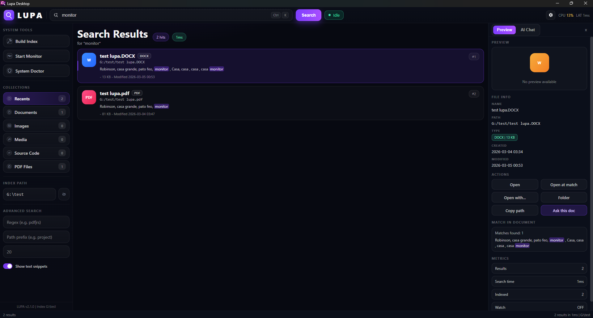

# LUPA - Universal Local AI Indexer

Ultra-fast local file indexer and search app for Windows, built in Rust.  
Offline-first, privacy-first, no cloud services, no telemetry by default.

LUPA is ultra-efficient by design: fast local search, minimal resource usage, and a lightweight footprint (~16 MB installed app). Built in Rust for top-tier performance, privacy, and reliability. Under the hood, it is engineered for low-latency local retrieval with bounded resource usage: Tantivy handles full-text retrieval, SQLite stores metadata, and Rayon parallelizes scan/extract stages. On a warm index, performance is tracked with percentile latency metrics (p50/p95/p99), not averages alone.

## Download

- [Download Windows installers (.exe and .msi) - v0.1.0](https://github.com/RobinsonBeato/Universal-Local-AI-Indexer/releases/tag/v0.1.0)

### Checksums (SHA-256)

- `.exe`: `793d4b75e2b1e8b98c382265bd86fbd182b3d110a7e377fda1ce743a6d949376`
- `.msi`: `b86448194b8dd48e08618f5e7eef18f0b7e806375cd2669ede454e15587af989`

## Why LUPA

- Offline-first: all indexing and search run locally.
- $0 cloud cost: no external APIs required.
- Ultra-fast search: Tantivy full-text + SQLite metadata.
- Low memory footprint and efficient CPU usage.
- Lightweight installed app footprint (~16 MB executable).
- Incremental indexing: re-index changed files only.
- Stable output: human-readable CLI and `--json` for automation.
- Privacy defaults: sensitive system folders excluded out of the box.

## Performance Model

- Retrieval path: Tantivy query execution over persisted inverted index, with metadata enrichment from SQLite.
- Incremental cost model: update work scales with `ΔN` (changed files), not full corpus `N`.
- Parallel indexing pipeline: filesystem traversal + extraction executed with Rayon worker pools.
- Latency objective: warm-index search typically `< 50ms p95` on SSD.
- Local reference run (`docs/benchmarks.md`, 2026-03-05): `overall.p95_ms = 25` across 10 queries.
- User-facing install size: app executable footprint around `~16 MB`.

## Current Apps

- `lupa` (CLI): automation-friendly indexing and search.
- `lupa-desktop-tauri` (desktop): modern WebView UI powered by the same Rust core.
- `lupa-gui` (legacy egui app): still available during transition/testing.

## Screenshot



## What gets indexed

- File path and name for all discovered files.
- Text content for configured plain-text/source extensions.
- Optional structured extraction for `pdf` and `docx` (size-limited by config).

## Quickstart

### 1) Build

```bash
cargo build --workspace
```

### 2) Run desktop app (recommended)

```bash
cargo run -p lupa-desktop-tauri
```

### 2.1) Build Windows installer (.exe / .msi)

Requirements:

- Windows 10/11
- WebView2 runtime installed
- Rust toolchain + MSVC build tools

Build release installers:

```powershell
cd crates/desktop-tauri
cargo tauri build
```

Artifacts are generated in:

- `target_local/release/bundle/nsis/*.exe`
- `target_local/release/bundle/msi/*.msi`

Installer behavior:

- standard install flow for public distribution
- uses app icon from `crates/desktop-tauri/icons/main-icon.ico`

### 3) Run CLI

```bash
cargo run -p lupa -- --root "G:\\" index build
cargo run -p lupa -- --root "G:\\" index backfill
cargo run -p lupa -- --root "G:\\" search "connection error" --limit 20 --highlight --stats
```

JSON output example:

```bash
cargo run -p lupa -- --root "G:\\" search "query" --json
```

### 4) Keep index fresh

```bash
cargo run -p lupa -- --root "G:\\" index watch --interval-secs 2
```

### 5) Validate environment

```bash
cargo run -p lupa -- --root "G:\\" doctor
```

## CLI Commands

- `lupa index build [--json]`
- `lupa index backfill [--json]`
- `lupa index watch [--interval-secs N] [--json]`
- `lupa search "<query>" [--json] [--limit N] [--path-prefix ...] [--regex ...] [--highlight] [--stats]`
- `lupa doctor [--json]`

## Desktop Features (Tauri + WebPanel)

- Index root selector + controls (`Build Index`, `Start/Stop Monitor`, `System Doctor`).
- Fast result list with smooth scrolling and incremental "load more".
- Category collections (Recents, Documents, Images, Media, Source Code, PDF Files).
- Advanced filters (regex, path prefix, max results, snippets toggle).
- Rich preview panel:
  - image thumbnail/preview when file is image
  - metadata (name, path, type, created/modified, size)
  - quick actions (`Open`, `Open at match`, `Open with`, `Folder`, `Copy path`)
- Document Chat panel (`Extractive` / `Local AI` modes).
- First-run onboarding:
  - language selection (`es` / `en`)
  - terms acceptance (MIT)
  - optional local AI setup trigger

## Document Chat Modes

### 1) Extractive (default)

- No model download.
- Fast and deterministic.
- Answers from extracted snippets + file metadata.

### 2) Local AI (optional)

- Uses local `llama-server` + GGUF model.
- Fully offline inference.
- Document-aware prompt context.
- Language-aware responses (`es` / `en`).

## Local AI Setup (Windows, one-time)

Install lightweight local runtime + model:

```powershell
powershell -ExecutionPolicy Bypass -File .\scripts\ai\setup-local-ai.ps1
```

Artifacts are installed outside the repo:

- `%LOCALAPPDATA%\Lupa\runtime\`
- `%LOCALAPPDATA%\Lupa\models\`

Optional manual server launch:

```powershell
powershell -ExecutionPolicy Bypass -File .\scripts\ai\run-local-ai-server.ps1
```

## Configuration (`config.toml`)

LUPA reads `config.toml` from the selected root.

```toml
excludes = ["node_modules", ".git", "target", ".lupa", "AppData", "Program Files", "Windows", "System32"]
include_extensions = ["txt", "md", "log", "rs", "toml", "json", "js", "ts", "py", "sql"]
max_file_size_bytes = 2097152
max_structured_file_size_bytes = 10485760
hash_small_file_threshold = 65536
threads = 0

[qa]
mode = "extractive" # "extractive" | "local_model"
model_path = "%LOCALAPPDATA%\\Lupa\\models\\qwen2.5-0.5b-instruct-q4_k_m.gguf"
endpoint = "http://127.0.0.1:8088"
llama_server_path = "%LOCALAPPDATA%\\Lupa\\runtime\\llama-server.exe"
auto_start_server = true
max_tokens = 256
timeout_ms = 12000
```

Notes:

- `threads = 0` uses all available CPU cores.
- `max_structured_file_size_bytes` controls extraction budget for `pdf/docx`.
- `qa.mode = "extractive"` avoids model startup and keeps the app lightweight.

## Default Excludes (privacy + safety)

- `node_modules`
- `.git`
- `target`
- `.lupa`
- `AppData`
- `Program Files`
- `Windows`
- `System32`

## Benchmarks

Run basic benchmark suite:

```powershell
./scripts/bench.ps1 -Root . -Release -Warmup -Runs 5 -OutJson ./.lupa/bench/latest.json
```

Target on warm index (SSD): typical search under `50ms` p95.

## Quality Gates

```bash
cargo fmt --all --check
cargo clippy --all-targets --all-features -- -D warnings
cargo test --all
```

## Documentation

- Architecture: [docs/architecture.md](docs/architecture.md)
- Benchmarks: [docs/benchmarks.md](docs/benchmarks.md)
- Windows install/release: [docs/install-windows.md](docs/install-windows.md)
- WebPanel notes: [crates/gui/webpanel/README.md](crates/gui/webpanel/README.md)
- Contributing guide: [CONTRIBUTING.md](CONTRIBUTING.md)

## License

MIT - Copyright (c) 2026 Robinson Beato
